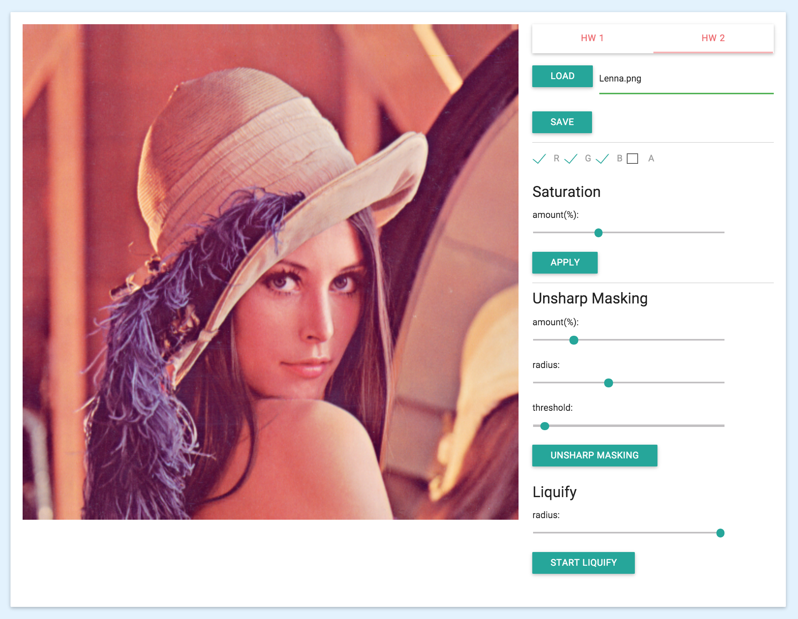
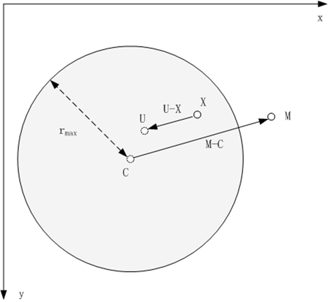
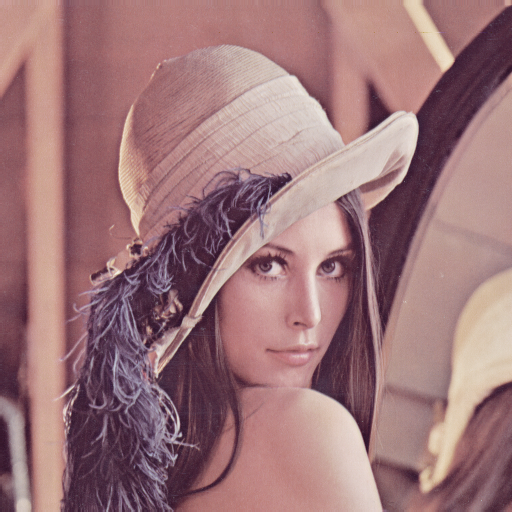
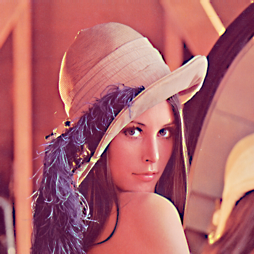
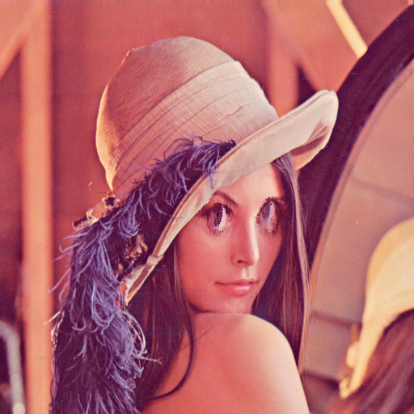

#数字图像处理作业二
###饱和度增强•锐化•液化
*软件21 周伯威  
2012012221*

***

### 一、操作界面

右侧区域分为四部分，从上到下依次为:

* 文件读写
* 饱和度增强
* USM锐化
* 液化

注: 液化操作需要较缓慢地移动鼠标

### 二、实现方法
##### 2.1 饱和度增强
将图像颜色由RGB空间转到HSL空间，修改S通道数值

##### 2.2 锐化
参考了Photoshop的实现方法:

1. 进行半径为radius的高斯模糊得到smooth图像
2. 将两图做差得到value，找到两图相差超过threshold色阶的像素
3. 将这些像素加上value*amount得到最终的颜色

##### 2.3 液化

上图中，鼠标运动为$\vec{CM}$，圆形为修改的像素区域，$\vec{XU}$表示使用U点处像素替代X点处像素。
使用下面公式计算U点位置:  

$$\vec{u} = \vec{x}-(\frac{r_{max}^2-\left| \vec x -\vec c \right|^2}{r_{max}^2-\left| \vec x -\vec c \right|^2+\left| \vec m -\vec c \right|^2})^{2}(\vec{m}-\vec{c})$$  

  
  
  
  
  
  
### 三、效果展示  

饱和度设置为50%

半径20px，阈值55色阶，数量169%的锐化

半径20px的液化

#数字图像处理作业一
###中值滤波与高斯滤波
*软件21 周伯威  
2012012221*

***

### 一、操作界面

右侧区域分为三部分，从上到下依次为:

* 文件读写
* 中值滤波
* 高斯滤波

其中，滤波可选择滤波器的尺寸、滤波操作的颜色通道。  

高斯滤波还可对卷积模板进行编辑。程序会对卷积模板进行归一化，以防止亮度改变。  

### 二、代码说明
代码在src文件夹中，与GUI相关的代码、图像处理的上层代码均在index.html中，图像处理的核心代码在ZImage.js中。

### 三、效果展示

原图

中值滤波(半径=5)

中值滤波(红色通道，半径=5)

高斯滤波(半径=7，sigma=2)

自定义模板滤波(模板为长11像素水平线条)

自定义模板滤波(绿色+蓝色通道，模板为长5像素45°线条)

