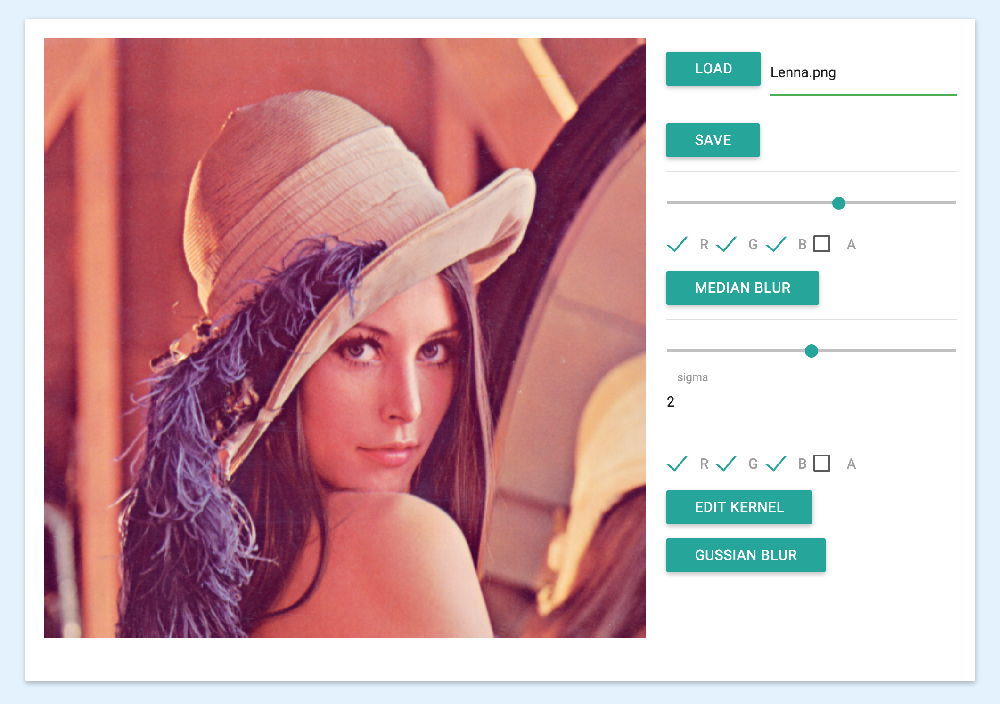

#数字图像处理作业一
###中值滤波与高斯滤波
*软件21 周伯威  
2012012221*

***

### 一、操作界面

右侧区域分为三部分，从上到下依次为:

* 文件读写
* 中值滤波
* 高斯滤波

其中，滤波可选择滤波器的尺寸、滤波操作的颜色通道。  

高斯滤波还可对卷积模板进行编辑。程序会对卷积模板进行归一化，以防止亮度改变。  

### 二、代码说明
代码在src文件夹中，与GUI相关的代码、图像处理的上层代码均在index.html中，图像处理的核心代码在ZImage.js中。

### 三、效果展示

原图

中值滤波(半径=5)

中值滤波(红色通道，半径=5)

高斯滤波(半径=7，sigma=2)

自定义模板滤波(模板为长11像素水平线条)

自定义模板滤波(绿色+蓝色通道，模板为长5像素45°线条)

